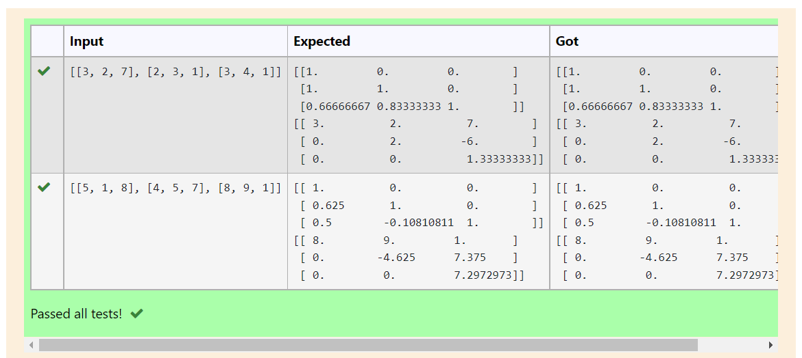

# LU Decomposition 

## AIM:
To write a program to find the LU Decomposition of a matrix.

## Equipments Required:
1. Hardware – PCs
2. Anaconda – Python 3.7 Installation / Moodle-Code Runner

## Algorithm
1. 
2. 
3. 
4. 

## Program:
(i) To find the L and U matrix
```
/*
Program to find the L and U matrix.
Developed by: K.Sangeetha
RegisterNumber: 21500118
*/
# To print L and U matrix
import numpy as np
import scipy
from scipy.linalg import lu
A=eval(input())
P,L,U=lu(A)
print(L)
print(U)
```

(ii) To find the LU Decomposition of a matrix
```
/*
Program to find the LU Decomposition of a matrix.
Developed by: K.Sangeetha
RegisterNumber: 21500118
*/

# To print X matrix (solution to the equation)
import numpy as np
from scipy.linalg import lu_factor, lu_solve
A=eval(input())
B=eval(input())
lu,piv=lu_factor(A)
x=lu_solve((lu, piv), B)
print(x)
```

## Output:



## Result:
Thus the program to find the LU Decomposition of a matrix is written and verified using python programming.

